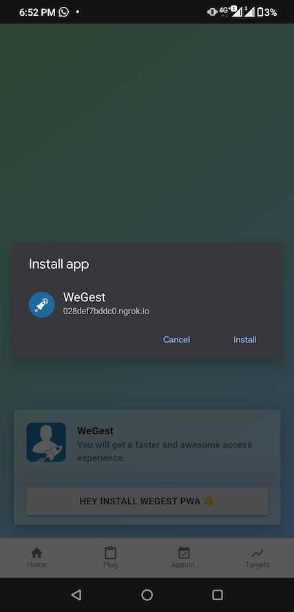

# WEGEST Frontend - Next.js - PWA - Typescript

## Prerequisities

Node.js 15.x

## Script Commands

1. Lint code

```
$ yarn xo --fix
```

2. Development locally

```
$ yarn dev
```

3. Test

- Unit Test

```
$ yarn test
```

- e2e Test

```
$ yarn e2e
```

## How to add translation

Inside `root/i18n/` directory, you can create a new language file like `it.lang.ts`, add new languages with key following the format below.

```
const resources: Resource = {
	translation: {
		welcome: 'benvenuta'
	}
}
```

And use it like `t('welcome')`.

If you want to add new key/word, you can simply add it into above object in every language file.
e.g.:

```
...
translation: {
	...
	[new_key]: 'new_word'
}
...
```

For more detail, please check the [i18next](https://www.i18next.com/translation-function/essentials)

## PWA Install Prompt

To install the app as a PWA, navigate to `/install` and click on the install button. Follow the provided instructions which depend on your platform.


